# EXNO5APPDS

# Developed by Sreevalsan

# AIM:

      To implement Dashboards creation with Plotly and Dash using python.
      

# About Dash and Plotly tools:

Dash is a Python framework for building analytical web applications. Dash helps in building responsive web dashboards that is good to look at and is very fast without the need to understand complex front-end frameworks or languages such as HTML, CSS, JavaScript. Let’s build our first web dashboard using Dash.

Plotly library in Python is an open-source library that can be used for data visualization and understanding data simply and easily. Plotly supports various types of plots like line charts, scatter plots, histograms, box plots, etc.

# ALGORITHM:

Step 1: Import Necessary Library like dash and plotly.

Step 2: Load the dataset.

Step 3: Add dropdown using layout function and include the necessary options.

Step 4: Display the necessary visualization tools and include the necessary parameters.

Step 5: Display the output.

# CODING AND OUTPUT:

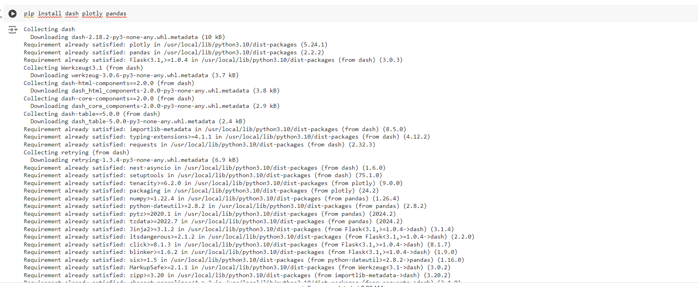

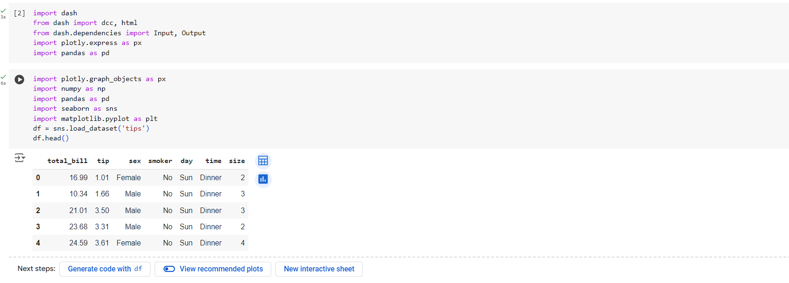

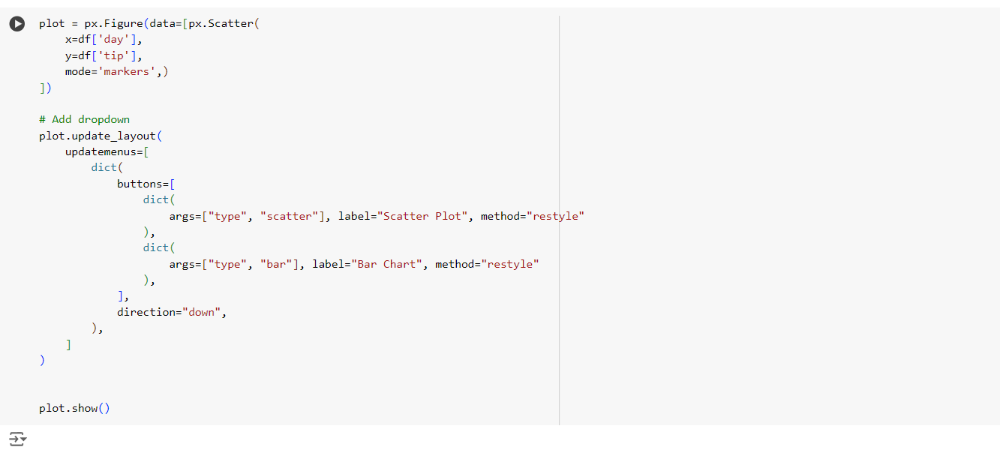

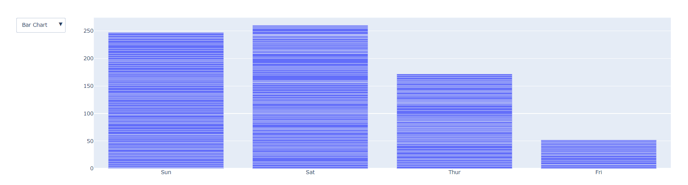

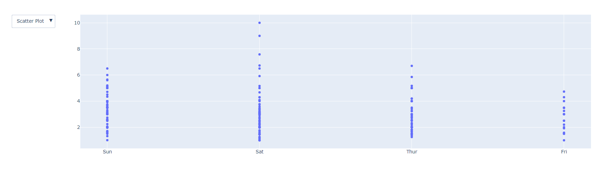

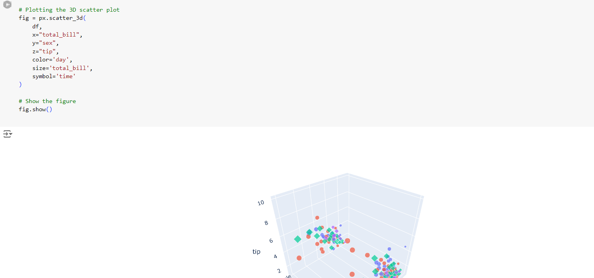

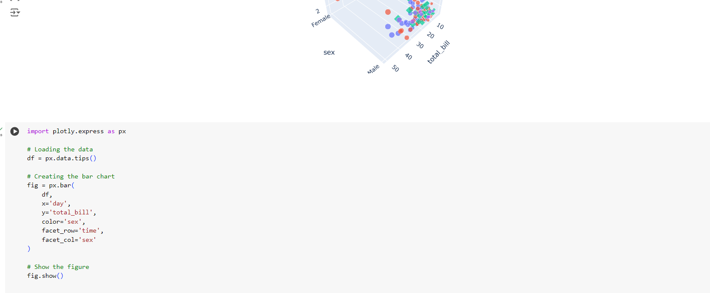

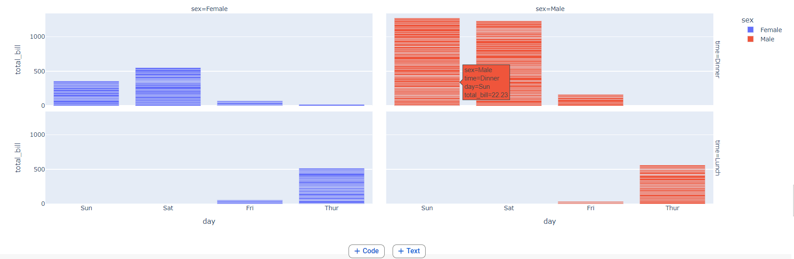

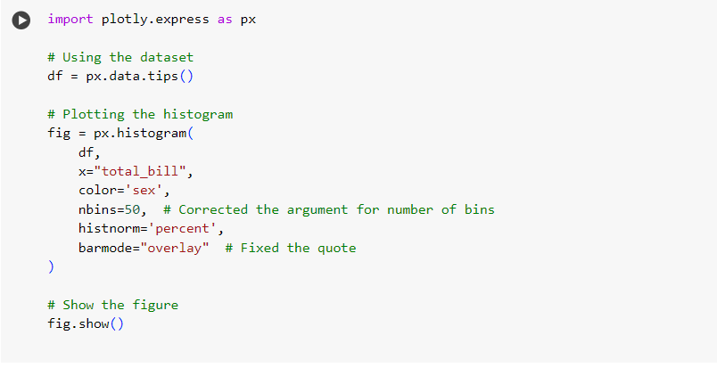

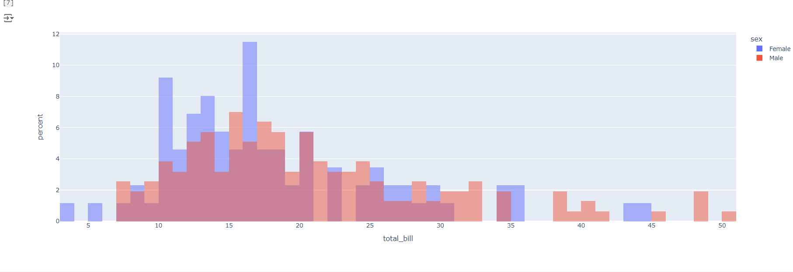

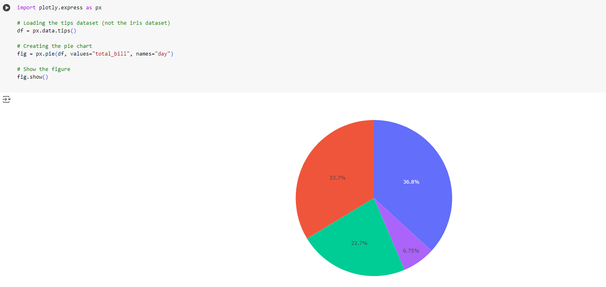

# RESULT:

We have sucessfully implemented Dashboards creation with Plotly and Dash using python.

